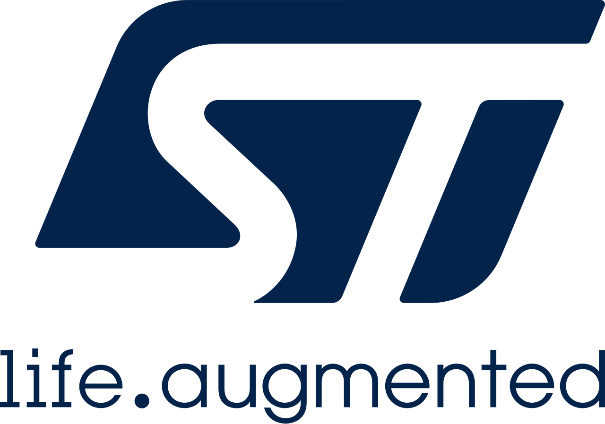
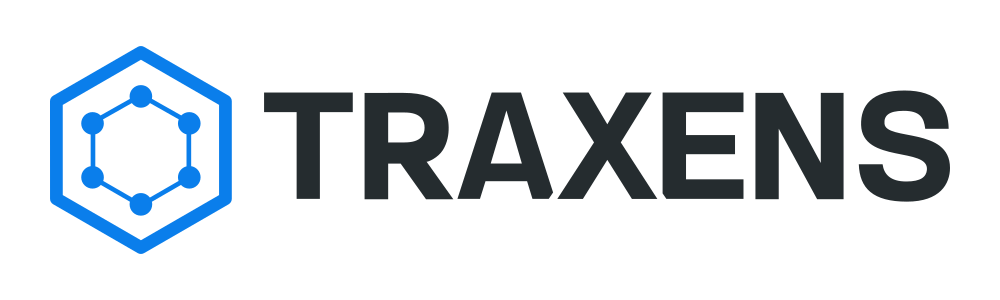
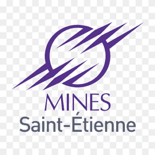

# Computer Science Engineer

📧 [timothee.cloupmartin@gmail.com](mailto:timothee.cloupmartin@gmail.com) 🔗 [LinkedIn](https://fr.linkedin.com/in/timoth%C3%A9e-cloup-martin-b8b203252)

🛠 **Technical Skills:** 

---

## Projects

### 🎯  [CV Match Engine](https://github.com/timotheeCloup/CVEE)
Finding the perfect job shouldn't feel like looking for a needle in a haystack. I built CVEE (CV Embedding Engine) to bridge the gap between complex resumes and thousands of daily job listings using the power of Semantic Search.
- Real-time Data Pipeline: I engineered a custom pipeline that ingests and processes **~1,200 Master’s level job offers** daily from France Travail.
- AI-Powered Matching: Instead of simple keyword filtering, I used **Hugging Face models** to transform job descriptions into vector embeddings, capturing the "true meaning" behind every offer.
- Instant Recommendations: I developed a FastAPI backend that compares a user's CV against the database to deliver the most relevant matches based on vector similarity.

> Stack: Python, Spark, Docker, Kubernetes, Databricks, AWS, FastAPI, Git

---

### [Tranfuzz Performance Evaluation](https://github.com/timotheeCloup/TranFuzz_performance_evaluation)
Joint Academic-Industry Research Project in collaboration with STMicroelectronics.

Evaluation of the TranFuzz model, a **black-box attack method** leveraging **Domain Adaptation** and **Fuzzing** to generate highly transferable adversarial examples, applied both for attack and for defense through model retraining.
- Demonstrated that the TranFuzz attack reduced model accuracy to **as low as 52%** under black-box conditions.
- Evaluated adversarial retraining using TranFuzz-generated samples, which improved model robustness but did not
perform better than well-known methods such as Carlini & Wagner.

> Stack: Pytorch, Bash Scripting

---

## Work Experience

###  Data Scientist — *Thales*  
📍 Saint-Etienne, France, April 2025 - October 2025  
Joined the Investment Banking DataLab (20 data scientists & engineers).
- Designed an AI model for early detection of surface anomalies on telephoto lenses during the polishing process, achieving 65% accuracy in predicting defect appearance before final inspection, despite operating in a constrained.
- Analyzed FTM test bench data and optimized the acquisition range, **reducing re-testing for over 20%** of binocular units, resulting to recurring time savings and reduced operational costs in a high-cost production process.

> Stack: Pandas, DuckDB, PostgreSQL, Docker

---

###  Data Analyst — *Traxens*  
📍 Marseille, France, April 2024 - September 2024 \ 
- Implemented data visualization using Power BI, connected directly to the Snowflake Data Warehouse.
- Delivered client-facing dashboards enabling operational monitoring of **50000+ smart containers** across 3 major clients.
- Developed an internal dashboard providing global visibility over **300000+ smart containers**, with detailed regional
insights for Data and Customer Service teams.

> Stack: SQL, Snowflake, PowerBI, Pandas, AWS

---

## Education

###  Computer Science Engineer — *Ecole des Mines de Saint-Étienne*
*2022 – 2025*
* **Specialization:** Artificial Intelligence, Data Science, Embeded Systems
* **Core Courses:** Machine Learning, Databases, Computer Systems and Architecture, System Design, Robotics

###  Academic Exchange — *City University of Hong Kong*
*2024 – 2025*
* **Specialization:** Data Science, Data Engineering
* **Core Courses:** Machine Learning, Cloud Computing, Database Management

###  French "Classes Préparatoires" (CPGE) — *Lycée La Martinière Monplaisir, Lyon*
*2019 – 2022*
* **Core Courses:** Statistics, Algebra, Analysis, Physics, Engineering Sciences
